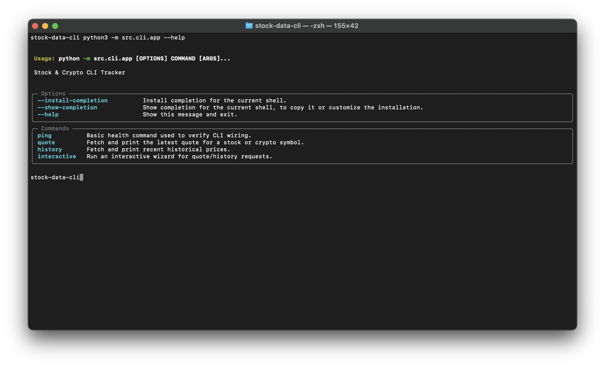
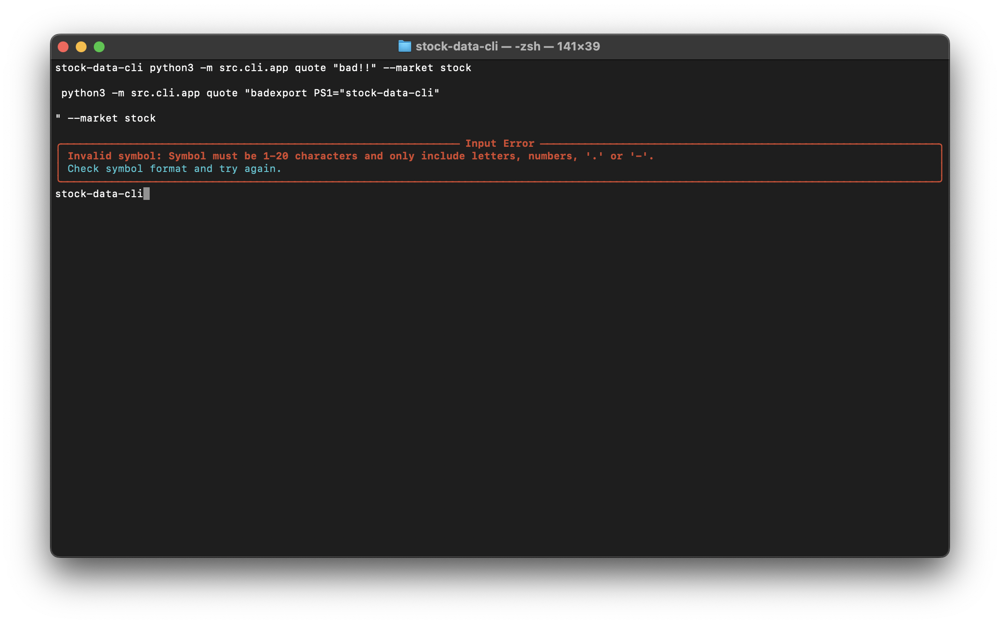
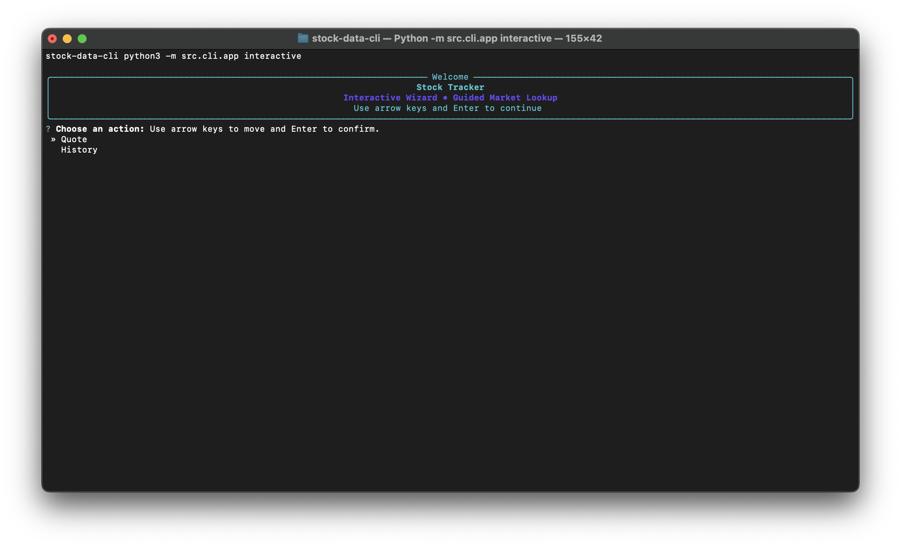
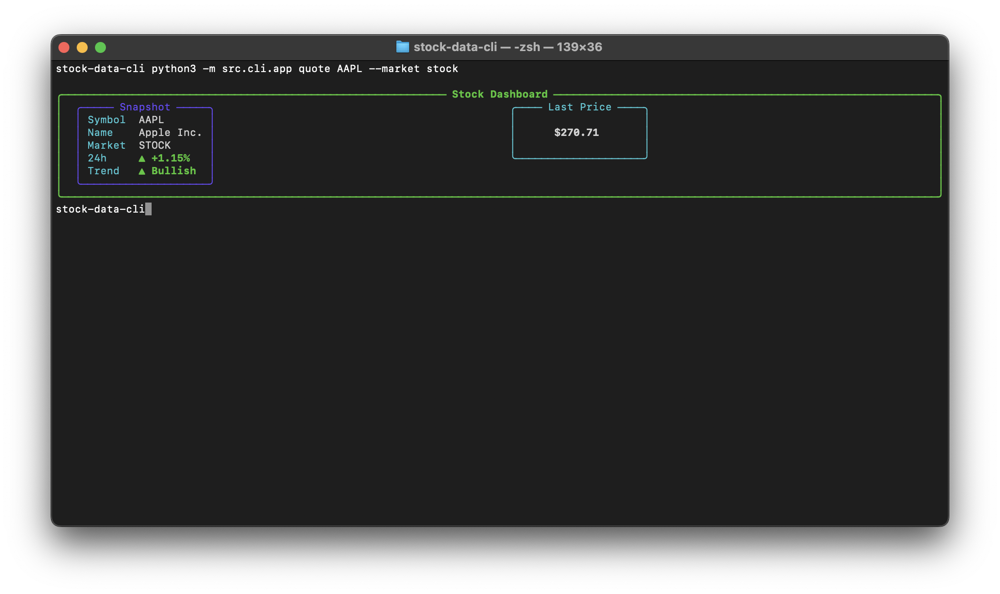
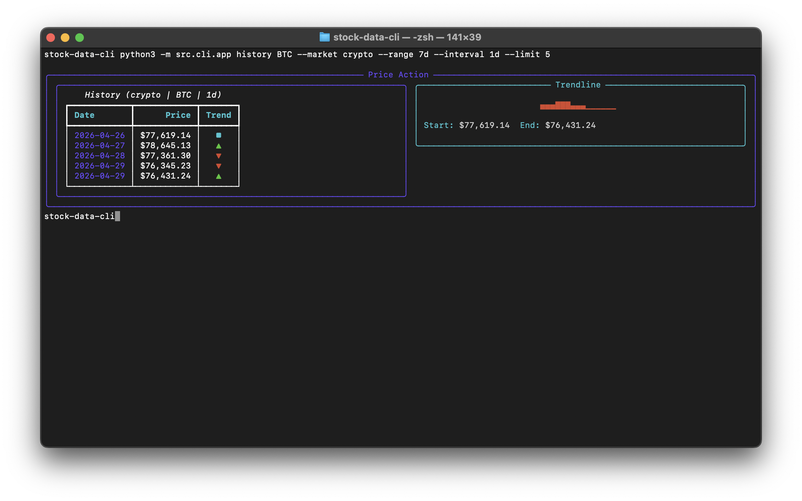

# Stock & Crypto CLI Tracker


## What It Does
Stock & Crypto CLI Tracker is a Python command line application for checking market data from your terminal. The goal is to provide a clean and reliable workflow for quote lookups, historical snapshots, and market context without leaving the command line.

This project is being built in phased milestones with strong emphasis on testability, modular architecture, and CI/CD automation. Current functionality includes a baseline CLI command used to validate app wiring and delivery pipeline setup.

## Screenshots / GIFs

### Ping Output


### Help Output


### Quote Rich Table


### History Rich Table


### Error Panel


### Interactive Wizard


### Quote Dashboard Card


### History Sparkline


## Installation
1. Clone the repository:
   ```bash
   git clone https://github.com/<your-username>/<your-repo>.git
   cd <your-repo>
   ```
2. Create and activate a virtual environment:
   ```bash
   python -m venv .venv
   source .venv/bin/activate
   ```
3. Install dependencies:
   ```bash
   pip install -r requirements.txt
   ```

## Configuration
The app reads runtime configuration from environment variables (and supports local `.env` files via `python-dotenv`).

Common variables:
- `REQUEST_TIMEOUT_SECONDS` (default: `10`)
- `MAX_RETRIES` (default: `3`)
- `API_USER_AGENT` (default: `stock-stat-tracker/0.1`)
- `STOCK_API_KEY` (optional, used in provider phases)
- `CRYPTO_API_KEY` (optional, used in provider phases)

### Note for Grader
If your environment uses API-key-backed provider variants, add keys through environment variables and do not commit them. Any required keys for evaluation can be shared through Canvas submission comments as instructed by the course.

## Usage & Examples
Run the baseline health command:

```bash
python -m src.cli.app ping
```

Expected output:

```text
pong
```

Show command help:

```bash
python -m src.cli.app --help
```

Launch interactive wizard mode (arrow-key menu):

```bash
python -m src.cli.app interactive
```

Fetch a stock quote:

```bash
python -m src.cli.app quote AAPL --market stock
```

Example output (table shape):
- Dashboard card with market emoji, stylized price panel, and trend arrows (`▲` / `▼`).

Fetch crypto quote:

```bash
python -m src.cli.app quote BTC --market crypto
```

Fetch recent price history:

```bash
python -m src.cli.app history ETH --market crypto --range 7d --interval 1d --limit 5
```

Example output (table shape):
- History panel with sparkline trendline and columns: `Date`, `Price`, `Trend`.

Show traceback output for troubleshooting:

```bash
python -m src.cli.app quote AAPL --market stock --debug
```

## Project Structure
```text
.
├── AGENTS.md
├── .agent_docs/
├── docs/plans/
├── src/
│   ├── cli/
│   │   ├── app.py
│   │   ├── wizard.py
│   │   └── commands/
│   │       └── market.py
│   ├── core/
│   │   ├── api_client.py
│   │   ├── market_service.py
│   │   └── models.py
│   └── utils/
│       ├── config.py
│       └── formatting.py
├── tests/
│   ├── core/
│   │   ├── test_api_client.py
│   │   └── test_market_service.py
│   ├── utils/
│   │   ├── test_config.py
│   │   └── test_formatting.py
│   ├── test_cli.py
│   └── test_wizard.py
└── .github/workflows/
    └── test.yml
```

## Architecture Notes
- `src/cli/` handles command routing and user interaction.
- `src/cli/rendering.py` contains Rich table/panel rendering helpers.
- `src/cli/rendering.py` now renders dashboard quote cards, history sparklines, and wizard banner components.
- `src/cli/wizard.py` adds guided arrow-key prompts for quote/history flows.
- `src/core/` contains reusable API client logic with timeout, retry, and normalized error behavior.
- `src/core/market_service.py` integrates provider endpoints and normalizes stock/crypto quote/history payloads.
- `src/utils/` provides shared config/env parsing and output formatting helpers.
- Tests use mocked HTTP transports; no live external API calls are made in the automated suite.

## Known Limitations & Future Ideas
- Crypto symbol resolution uses a small fast-path map plus CoinGecko search fallback; ambiguous symbols may need explicit provider IDs in future improvements.
- Provider payload shapes may change over time; additional schema hardening and fallback paths can be added in a future pass.
- A richer interactive TUI dashboard is still planned as a future enhancement.
- Interactive wizard depends on local terminal prompt support for `questionary`; non-interactive shells should use standard CLI commands.
